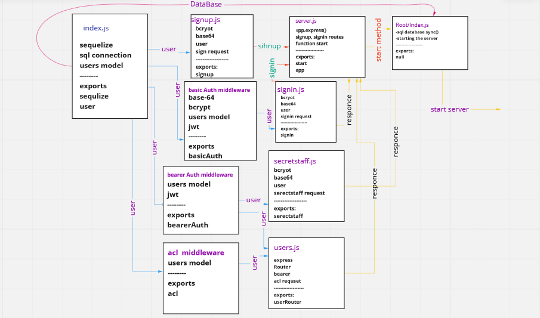

# auth-api

In this repo we implement Role Based Access Control (RBAC) using an Access Control List (ACL) and implementing a fully functional, authenticated and authorized API Server and I make the following restrictions: Regular users can READ, Writers can READ and CREATE, Editors can READ, CREATE, and UPDATE, and Administrators can READ, CREATE, UPDATE, and DELETE

## links

* [PR Link](https://github.com/salammustafa728/auth-api/pull/1)

* [action](https://github.com/salammustafa728/auth-api/actions)

* [heroku](https://salam-auth-api-1.herokuapp.com/)

## Routes 

* /api/v2/clothesR
* /api/v1/img
* /signin
* /signup

### UML diagram 

